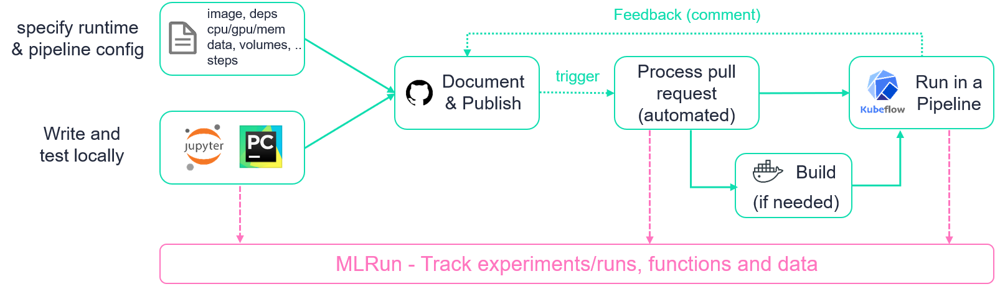
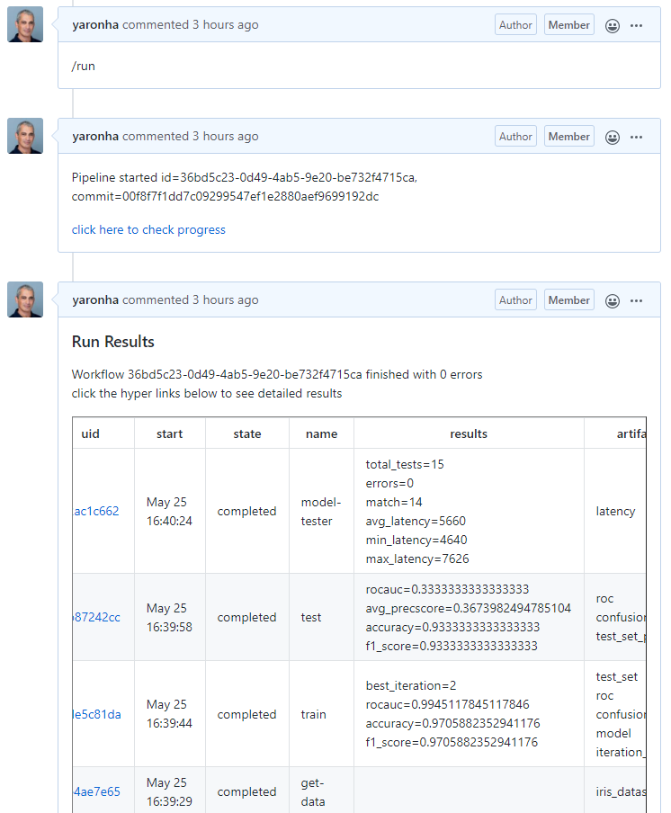
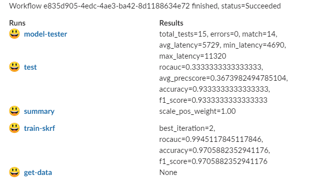
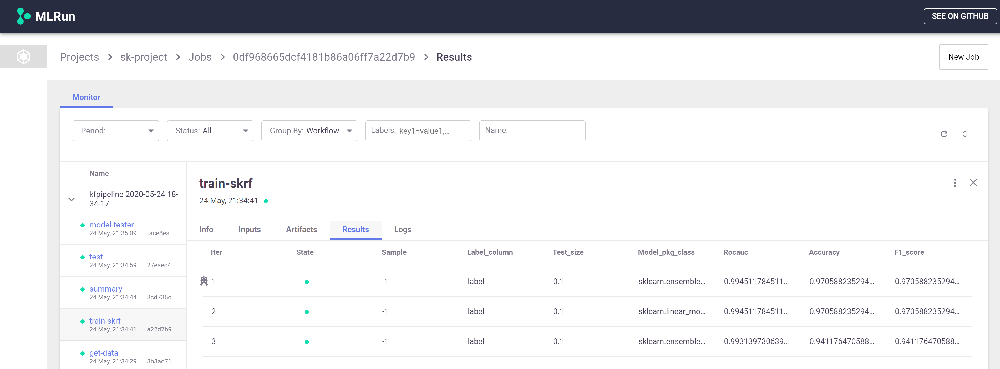
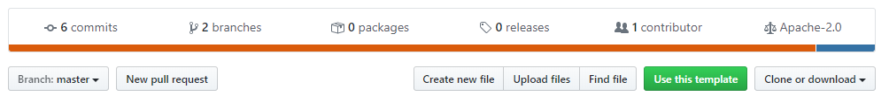

# ML Pipeline Automation and CI/CD Using GitHub Actions, Kubeflow and MLRun

Machine learning (ML) pipelines allow us to automate multi-stage workflow which comprise of 
data ingestion, data preparation, model training, validation and finally deployment.

Every time our code, data or parameters change we may want to re-evaluate our model accuracy and performance before we deploy.
This resembles the CI/CD practice for delivering code to production with the additional aspects of data and parameter/configuration versioning,
and may require more powerful resources (computation cluster, GPUs, data processing engines, etc.).

This template repo demonstrates how you can automate the development, testing, and deployment 
of machine learning projects using the following tools:

* [**GitHub actions**](https://github.com/features/actions) - used for code and metadata versioning, workflow triggering, and process tracking
* [**Kubeflow Pipelines**](https://www.kubeflow.org/docs/pipelines/overview/pipelines-overview/) - Used to execute ML pipeline steps on a (remote) Kubernetes cluster  
* [**MLRun**](https://github.com/mlrun/mlrun) - Used for end to end MLOps automation and tracking, [read more below](#mlrun-overview).

To clone and run with your own environment or on [**iguazio data science platform**](https://www.iguazio.com/), check the [**instructions below**](#how-to-run-with-your-cluster).

## How Does It Work?

This repo is representing an **mlrun project**, mlrun projects consists of **Functions** (code), **Artifacts** (data), **Workflows**, and **Parameters/secrets**. 
The [**project.yaml**](project.yaml) file list all of those elements.

Project elements can be linked (e.g. point to a library function which runs AutoML or data analysis, point to code/notebook files, point to external data objects, workflow files, etc.), 
or they can be embedded (e.g. store function code + configuration, workflow steps, etc.), in this example we show how to combine both.

The project file, workflow and embedded/linked code were generated by running the [**gitops_project notebook**](gitops_project.ipynb),
you can modify it to your needs, this is based on code from [MLRun Demos repo](https://github.com/mlrun/demos), 
where you can find more end to end ML Pipeline examples. 

When we change one of the elements (the project.yaml file or one of the other linked code/metadata files) and open a pull request (PR)
we can type `/run` in our PR, this will trigger running the ML Pipeline (as specified in the [workflow file](workflow.py)).
Once the pipeline starts, a comment will be added to your PR with a link to MLRun UI (allowing to track the progress), and when the ML Pipeline completes
MLRUn will write a result summary as a comment back into your PR with links to more details and data artifacts

**Flow diagram:**

 

 

**This is an example of the PR comments:**

 

  

**This is an example of the summary report sent to `Slack`:**

 

  

**The Kubeflow pipeline graph**

 

 

**MLRun UI showing the AutoML results (linked to from the PR)**

 

 

## What Is MLRun? 

MLRun is the first and currently only integrated open-source framework for end to end MLOps automation, it:
* Orchestrates job/pipeline from simple code or pre-baked functions (via Kubeflow and various k8s CRDs) 
* Runs, tracks and version projects comprising of experiments, jobs/functions, data, code, models and more.
* Provides an open marketplace for various ML, DL, Analytics, MLOps functions  
* Runs iterative AutoML, Hyper-param, or data analysis tasks on a distributed cluster  
* Automates deployment of models and real-time data processing functions using (Nuclio) real-time serverless engine 

Read more in [mlrun/mlrun](https://github.com/mlrun/mlrun)

## How To Run With Your Cluster

### Prerequisites

You need access to a working Kubernetes cluster with Kubeflow, Nuclio, and MLRun (see [installing MLRun](https://github.com/mlrun/mlrun#installation)) 
Or use [**iguazio data science platform**](https://www.iguazio.com/) with all of those pre-installed and managed.

### Clone and setup

#### 1. Copy this repo to your own GitHub account by clicking the `Use this template` button 

 

  

#### 2. Configure the required secrets and addresses

Under the repo settings select the `secrets` tab and configure the following:
* `MLRUN_DBPATH` - remote URL to mlrun service (e.g. `https://<address:port>`) 
* `SLACK_WEBHOOK` - optional, if you would like to get run summary into your slack 

When using Iguazio platform your should set the following:  
* `V3IO_USERNAME` - Iguazio platform username
* `V3IO_ACCESS_KEY` - Iguazio V3IO data layer credentials (copy from your user settings)
* `V3IO_PASSWORD` - user password
* `V3IO_API` - V3IO data access API url (copy from the services screen)

When using the open source version and a secure API gateway you can use the following secrets 
* `MLRUN_HTTPDB__USER` - remote username
* `MLRUN_HTTPDB__PASSWORD` (for basic auth) or `MLRUN_HTTPDB__TOKEN` (for Bearer token) 

### Customize 

Update and run the [**gitops_project notebook**](gitops_project.ipynb), 
The Notebook will generate the data ingestion function, the workflow code and the [**project.yaml**](project.yaml) files.
You can also run the workflow from the notebook, or you can run it from the pull request.

### Run from a PR

change the project.yaml file, the workflow, or other elements and create a pull request, 
once the PR is opened type `/run` in your PR.

For trouble shooting go to the `Actions` tab to see GitHub Actions workflow progress.  
   
